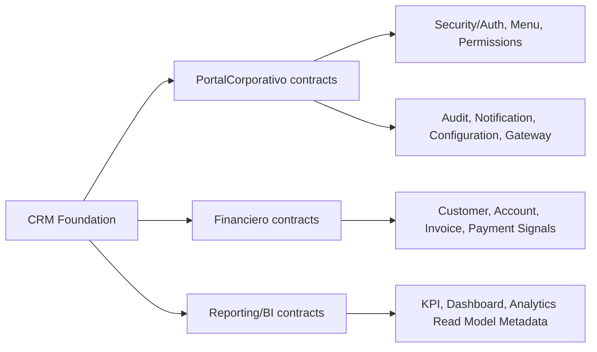

# CRM Cross-Module Dependency Map

```mermaid
flowchart LR
    CRM["CRM Foundation"] --> Portal["PortalCorporativo contracts"]
    CRM --> Financiero["Financiero contracts"]
    CRM --> Reporting["Reporting/BI contracts"]
    Portal --> Auth["Security/Auth, Menu, Permissions"]
    Portal --> Ops["Audit, Notification, Configuration, Gateway"]
    Financiero --> Signals["Customer, Account, Invoice, Payment Signals"]
    Reporting --> BI["KPI, Dashboard, Analytics Read Model Metadata"]
```

All arrows are planned contract dependencies, not runtime connections in Sprint 1.
